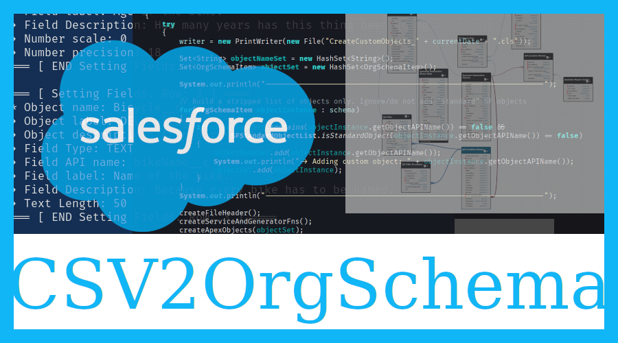
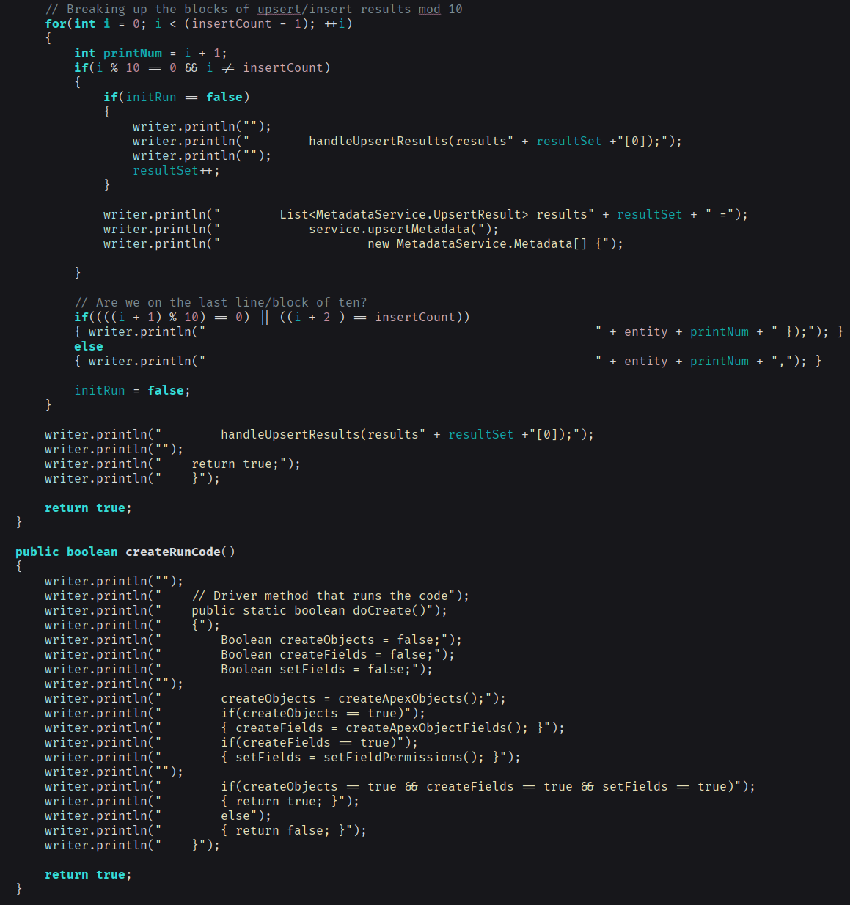
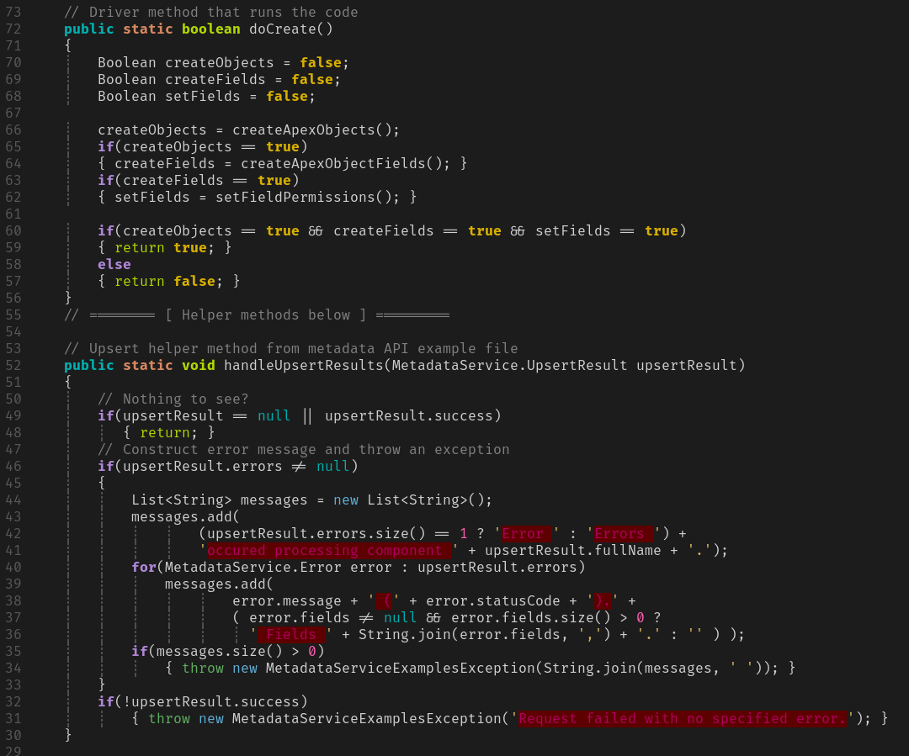
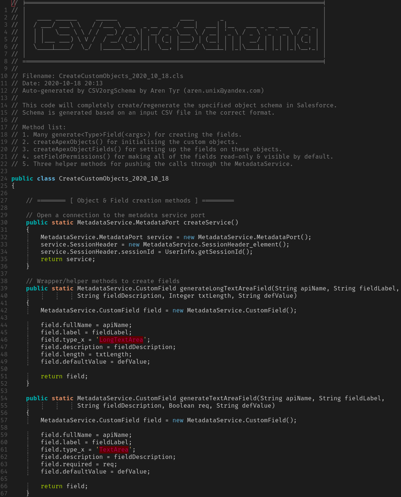

# CSV2OrgSchema

# 1\. Synopsis

This Java project programmatically generates an appropriate Salesforce Apex class that deploys the Metadata API to create any number of custom objects/fields purely from an input spreadsheet, thus bypassing the slow/tedious Salesforce web interface. It also improves on the [Salesforce object creator website](https://object-creator.salesforce.com/) which negates a lot of the benefit of using a spreadsheet to describe an object by not providing any customisation options for the specified fields; for example, the length of a text field or the exact type. The aim of this code is to provide a rapid method of completely describing a Salesforce object using any spreadsheet software that can export the result as an input CSV file. The result is a deployable class that uses the Metadata API. Moreover, since the file/class is completely portable and fully specifies all of the objects/fields, it means the entire Salesforce org schema can be effortlessly moved between orgs and dynamically recrated as necessary simply by deploying an executing the class. Furthermore, it also takes care of setting the field permissions so that the fields are immediately useable.

# 2\. Status

Software status is ALPHA but operational.  

What works:  

- Creation/generation of custom objects with most of the standard fields and specific options
- Object lookups and master-detail relationships are correctly handled
- Addition of fields on pre-existing standard objects
- Validation/error/sanity checking of the input CSV file

What is not yet implemented:  

- Formula fields
- Picklist fields/picklist generation

What is planned:  

- Suitable documentation on usage
- Test classes and code coverage
- A wrapper that will pre-package the generated class, together with the Metadata API class, generate an appropriate `package.xml`, and pack it into a ZIP so that everything can be instantly deployed via [Salesforce workbench](https://workbench.developerforce.com/).
- Automatic generation of an data dictionary from the schmea into markdown
- A GUI written in JavaFX that would allow creation from scratch, or import from CSV
